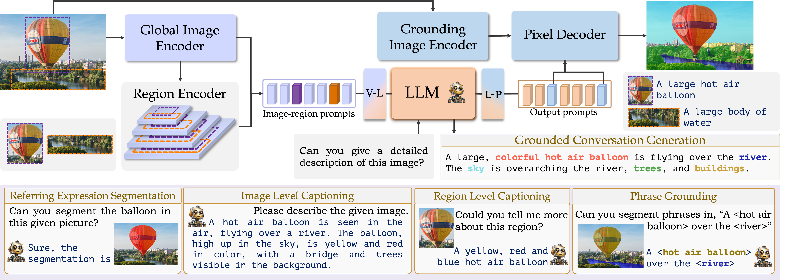
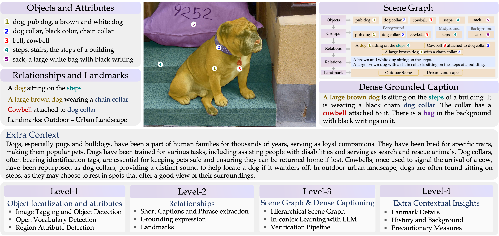
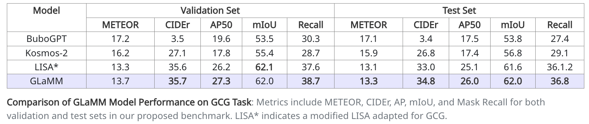
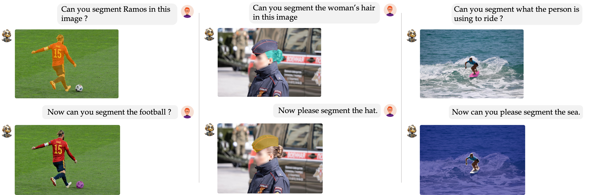
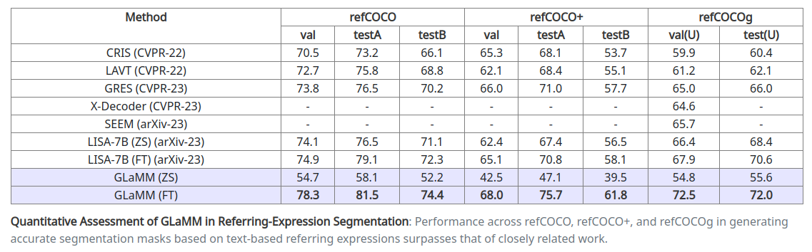
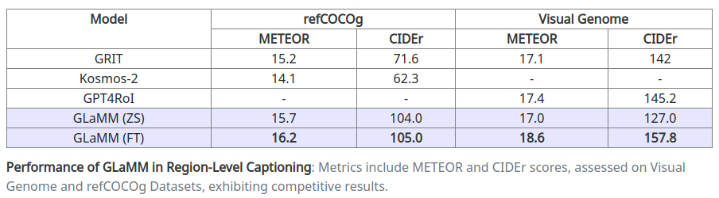

# GLaMM : Pixel Grounding Large Multimodal Model [CVPR 2024]
<p align="center">
    
</p>

#### [Hanoona Rasheed](https://www.hanoonarasheed.com/)\*, [Muhammad Maaz](https://www.muhammadmaaz.com)\*, [Sahal Shaji](https://www.linkedin.com/in/sahalshajim), [Abdelrahman Shaker](https://amshaker.github.io), [Salman Khan](https://salman-h-khan.github.io/), [Hisham Cholakkal](https://scholar.google.ae/citations?user=bZ3YBRcAAAAJ&hl=fr), [Rao M. Anwer](https://scholar.google.fi/citations?user=_KlvMVoAAAAJ&hl=en), [Eric Xing](https://www.cs.cmu.edu/~epxing), [Ming-Hsuan Yang](https://scholar.google.com.pk/citations?user=p9-ohHsAAAAJ&hl=en) and [Fahad Khan](https://sites.google.com/view/fahadkhans/home)

#### **Mohamed bin Zayed University of AI, Australian National University, Aalto University, Carnegie Mellon University, University of California - Merced, Linköping University, Google Research**

[](https://arxiv.org/abs/2311.03356)
[](https://grounding-anything.com)
[](https://glamm.mbzuai-oryx.ngrok.app)
[](https://mbzuai-oryx.github.io/groundingLMM)
[](https://www.youtube.com/watch?v=0dZ4dlNIGTY)

---

## 📢 Latest Updates
- **Nov-07-24**: VideoGLaMM is released. It extends the grounded conversation generation task for videos 🎥 ! Check it out at [VideoGLaMM](https://mbzuai-oryx.github.io/VideoGLaMM/) 🔥🔥
- **Mar-21-24**- We're excited to announce the release of [GranD](https://grounding-anything.com) dataset and the [GranD Automated Annotation Pipeline](docs/GranD.md#preparing-the-pretraining-annotations-from-grand-) 🔥
- **Feb-27-23**- We're thrilled to share that GLaMM has been accepted to CVPR 2024! 🎊
- **Dec-27-23**- GLaMM training and evaluation codes, pretrained checkpoints and GranD-f dataset are released [click for details](#-dive-deeper-inside-glamms-training-and-evaluation) 🔥🔥
- **Nov-29-23**: GLaMM online interactive demo is released [demo link](https://glamm.mbzuai-oryx.ngrok.app). 🔥
- **Nov-07-23**: GLaMM paper is released [arxiv link](https://arxiv.org/abs/2311.03356). 🌟
- 🌟 **Featured**: GLaMM is now highlighted at the top on AK's [Daily Papers](https://huggingface.co/papers?date=2023-11-07) page on HuggingFace! 🌟

---

##  GLaMM Overview

Grounding Large Multimodal Model (GLaMM) is an end-to-end trained LMM which provides visual grounding capabilities with the flexibility to process both image and region inputs. This enables the new unified task of Grounded Conversation Generation that combines phrase grounding, referring expression segmentation, and vision-language conversations. Equipped with the capability for detailed region understanding, pixel-level groundings, and conversational abilities, GLaMM offers a versatile capability to interact with visual inputs provided by the user at multiple granularity levels.

---

## 🏆 Contributions

- **GLaMM Introduction.** We present the Grounding Large Multimodal Model (GLaMM), the first-of-its-kind model capable of generating natural language responses that are seamlessly integrated with object segmentation masks.

- **Novel Task & Evaluation.** We propose a new task of Grounded Conversation Generation (GCG). We also introduce a comprehensive evaluation protocol for this task.

- **GranD Dataset Creation.** We create the GranD - Grounding-anything Dataset, a large-scale densely annotated dataset with 7.5M unique concepts grounded in 810M regions.

---

## 🚀 Dive Deeper: Inside GLaMM's Training and Evaluation

Delve into the core of GLaMM with our detailed guides on the model's Training and Evaluation methodologies.
- [**Installation**](./docs/install.md): Provides guide to set up conda environment for running GLaMM training, evaluation and demo.

- [**Datasets**](./docs/datasets.md): Provides detailed instructions to download and arrange datasets required for training and evaluation.

- [**GranD**](./docs/GranD.md): Provides detailed instructions to download the GranD dataset and run the automated annotation pipeline.

- [**Model Zoo**](./docs/model_zoo.md): Provides downloadable links to all pretrained GLaMM checkpoints.

- [**Training**](./docs/training.md): Provides instructions on how to train the GLaMM model for its various capabilities including Grounded Conversation Generation (GCG), Region-level captioning, and Referring Expression Segmentation.

- [**Evaluation**](./docs/evaluation.md): Outlines the procedures for evaluating the GLaMM model using pretrained checkpoints, covering Grounded Conversation Generation (GCG), Region-level captioning, and Referring Expression Segmentation, as reported in our paper.

- [**Demo**](./docs/offline_demo.md): Guides you through setting up a local demo to showcase GLaMM's functionalities.

## 👁️💬 GLaMM: Grounding Large Multimodal Model

The components of GLaMM are cohesively designed to handle both textual and optional visual prompts (image level and region of interest), allowing for interaction at multiple levels of granularity, and generating grounded text responses.

<p align="center">
  
</p>

---

## 🔍 Grounding-anything Dataset (GranD)

The [Grounding-anything](https://grounding-anything.com/) GranD dataset, a large-scale dataset with automated annotation pipeline for detailed region-level understanding and segmentation masks. GranD comprises 7.5M unique concepts anchored in a total of 810M regions, each with a segmentation mask.

<p align="center">
  
</p>

---
Below we present some examples of the GranD dataset.

<p align="center">
  
</p>

<p align="center">
  
</p>

---

## 📚 Building GranD-f for Grounded Conversation Generation

The [GranD-f](https://grounding-anything.com/GranD-f) dataset is designed for the GCG task, with about 214K image-grounded text pairs for higher-quality data in fine-tuning stage.

<p align="center">
  
</p>

---

## 🤖 Grounded Conversation Generation (GCG)

Introducing GCG, a task to create image-level captions tied to segmentation masks, enhancing the model’s visual grounding in natural language captioning.

<p align="center">
  
</p>

<p align="center">
  
</p>

---

## 🚀 Downstream Applications

### 🎯 Referring Expression Segmentation

Our model excels in creating segmentation masks from text-based referring expressions.

<p align="center">
  
</p>

<p align="center">
  
</p>

---

### 🖼️ Region-Level Captioning

GLaMM generates detailed region-specific captions and answers reasoning-based visual questions.

<p align="center">
  
</p>

<p align="center">
  
</p>

---

### 📷 Image Captioning

Comparing favorably to specialized models, GLaMM provides high-quality image captioning.

<p align="center">
  
</p>

---

## 💬 Conversational Style Question Answering

GLaMM demonstrates its prowess in engaging in detailed, region-specific, and grounded conversations. This effectively highlights its adaptability in intricate visual-language interactions and robustly retaining reasoning capabilities inherent to LLMs.

<p align="center">
  
</p>

---

<p align="center">
  
</p>

---

## 📜 Citation
```bibtex
  @article{hanoona2023GLaMM,
          title={GLaMM: Pixel Grounding Large Multimodal Model},
          author={Rasheed, Hanoona and Maaz, Muhammad and Shaji, Sahal and Shaker, Abdelrahman and Khan, Salman and Cholakkal, Hisham and Anwer, Rao M. and Xing, Eric and Yang, Ming-Hsuan and Khan, Fahad S.},
          journal={The IEEE/CVF Conference on Computer Vision and Pattern Recognition},
          year={2024}
  }
```

---
## 🙏 Acknowledgement
We are thankful to LLaVA, GPT4ROI, and LISA for releasing their models and code as open-source contributions.


---
[](https://www.ival-mbzuai.com)
[](https://github.com/mbzuai-oryx)
[](https://mbzuai.ac.ae)
